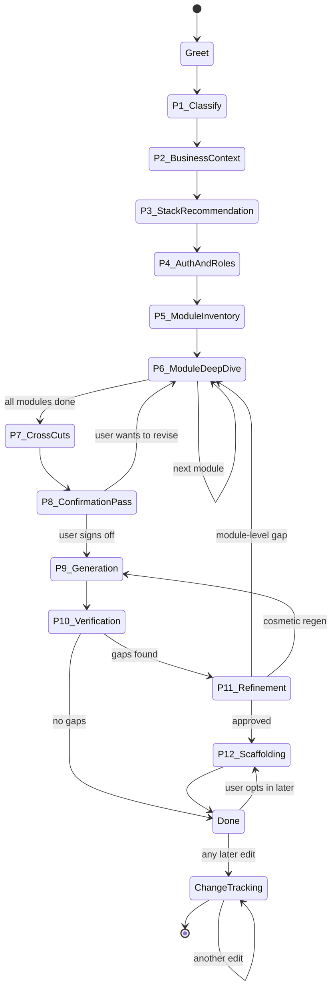

# 00 — Orchestration

The skill is a state machine. This file is the only source of truth for
phase transitions, entry/exit conditions, and what's loaded when.

## Phase definitions

### Greet

**Entry:** session start.
**Action:** "What are we designing today? One line is enough."
**Exit:** user has given a one-liner.

### Phase 1 — Classify project

**Entry:** one-liner exists.
**Load:** §1 of `01-discovery-questions.md`.
**Goal:** assign one project-type tag.
**Exit:** tag chosen.

### Phase 2 — Business context

**Entry:** type tag exists.
**Load:** §2 of `01-discovery-questions.md`.
**Goal:** capture personas, geography, scale, regulatory, pricing.
**Exit:** all five attributes captured (or explicitly marked unknown with
follow-up scheduled).

### Phase 3 — Stack archetype

**Entry:** business context captured.
**Load:** `02-stack-selection.md` + `03-archetype-recipes.md` + the relevant
recipes from `04-domain-recipes.md` based on project type.
**Goal:** walk the 10-question decision tree, land on an archetype + modifiers,
recap with reasoning, get user sign-off.
**Exit:** user confirms the archetype.

### Phase 4 — Auth & tenancy & roles & RBAC

**Entry:** archetype confirmed.
**Load:** §4 of `01-discovery-questions.md` + `10-rbac-matrix-guide.md`.
**Goal:** lock auth provider, tenancy axis, role list, and a draft role × top-
level-resource × action matrix.
**Exit:** matrix sketched.

### Phase 5 — Module inventory

**Entry:** auth/roles done.
**Load:** `05-module-decomposition.md` §module-grouping.
**Goal:** ask the user to list modules, propose grouping, flag commonly-missed
ones (audit log, settings, support, notifications, billing, impersonation,
webhooks, API keys, integrations).
**Exit:** confirmed module list.

### Phase 6 — Per-module deep dive (looped)

**Entry:** module list confirmed.
**Load:** `05-module-decomposition.md` (full) + `06-edge-case-guide.md` +
`07-proactive-prompts.md`.
**Goal:** for each module, walk the 20-step loop. Each step asks one question
at a time, adaptive based on prior answers, with recommendations.

**Module-done check (mutual agreement):**
At the end of each module, you produce a self-assessment block like:

> **Module self-assessment — `<module-name>`**
> - Pages captured: 4
> - UI components captured: 38
> - Actions captured: 17
> - APIs captured: 9
> - DB tables captured: 5
> - Wiring diagrams drafted: 4
> - State machines: 1
> - Async jobs: 2
> - Edge cases walked: 11 categories ✓ all applicable
> - Empty/loading/error states: ✓ all pages
> - Telemetry events: 14
> - a11y / i18n / responsive / copy / URL / perf / SEO: ✓ all applicable
> - Compliance / PII: 3 fields tagged
> - Test plan: drafted (12 critical paths)
> **I'd say this module is ready to move on. Anything you want to add or
> revise before we lock it?**

Only move on when **both** parties agree.

**Exit:** all modules locked.

### Phase 7 — Cross-cuts

**Entry:** all modules locked.
**Load:** §7-13 of `01-discovery-questions.md` (async, AI/voice, distribution,
compliance, NFR, integrations).
**Goal:** capture each cross-cut, only asking what's relevant.
**Exit:** all relevant cross-cuts captured.

### Phase 8 — Confirmation pass

**Entry:** cross-cuts done.
**Action:** produce a full recap document in chat:

> **Plan summary**
> - Project: `<name>` (`<type>`)
> - Archetype: `<A | B | C>` + modifiers `<…>`
> - Auth: `<provider>` with `<plugins>`; tenancy by `<axis>`
> - Roles: `<list>`
> - Modules (`<n>`): `<names>`
> - Async: `<…>` AI/Voice: `<…>` Distribution: `<…>` Compliance: `<…>`
> - Open questions still parked: `<list>`
>
> **Ready to generate?** Once I generate, future edits switch to
> change-tracking mode (every edit gets logged and bumps affected docs).
> Reply "go" or call out what to revise.

**Exit:** user says "go".

### Phase 9 — Generation

**Entry:** sign-off.
**Action:** write every file using `assets/templates/*`, matching code samples
to the chosen archetype. Generate in this order:

1. Foundation: `tech-stack.md`, `decisions.md`, `glossary.md`,
   `design-guidelines.md`, `changelog.md`, `changes-log.md`, `_templates/` copy
2. Per module folder (one at a time): `module.md`, `features/`, `api/`,
   `schema/`, `workflows/`, `state-machines/`, `async-jobs/`,
   `observability.md`, `compliance.md`, `test-plan.md`
3. Shared concerns: `shared/webhooks-incoming.md`, `shared/webhooks-outgoing.md`,
   `shared/async-architecture.md`, `shared/observability-architecture.md`,
   `shared/compliance-pii-inventory.md`, `shared/nfr.md`
4. Indexes: `index/modules.md`, `index/features.md`, `index/apis.md`,
   `index/schemas.md`, `index/workflows.md`
5. Root: `CLAUDE.md`, `README.md` (at project root, not inside `docs/`)
6. ADRs: one per major decision into `adr/`

**Exit:** all files written.

### Phase 10 — Verification

**Entry:** generation done.
**Load:** `09-verification-checklist.md` + `08-anti-patterns.md`.
**Action:** run all checks, produce a gap report.
**Exit:** gap report ready.

### Phase 11 — Refinement (human-gated)

**Entry:** gap report ready.
**Action:** present gaps to user, ask which to fix now. For each chosen gap,
route back to Phase 6 (if module-level) or Phase 9 (if cosmetic regen).
**Exit:** user says "good enough".

### Phase 12 — Scaffolding (optional)

**Entry:** user accepts scaffold offer after Phase 11.
**Load:** `14-scaffolding.md` + `13-supporting-skills-catalog.md`.
**Action:**
1. Confirm archetype-appropriate CLI (BTS / Amplify+Hasura stepwise / `pnpm dlx shadcn@latest init`).
2. Ask scaffolding questions one at a time (project name, name flags, addons).
3. Run the CLI (with user permission).
4. Copy the supporting skills relevant to this project into `.claude/skills/`.
5. Generate `skills-lock.json`.
6. Copy `docs/project/_templates/` into the new project.
**Exit:** project scaffolded + skills installed.

### Change tracking (ongoing)

**Entry:** any edit after initial generation.
**Load:** `11-change-tracking.md`.
**Action:** identify affected docs, rewrite, log change pointer, regenerate
affected diagrams (see `15-diagram-catalog.md`).
**Exit:** edit logged.

---

## Example session opening (the tone to maintain)

> Hey — let's spec this out properly so Claude Code can build it without
> guessing. I'll ask one question at a time, recommend with reasoning, and
> push back when answers are vague. Expect this to take a while (and we'll
> go deep on every module). Sound good?
>
> First question: **what are we building today?** One line is enough — I'll
> probe from there.

## What NOT to do

- Don't open with a long form or batch of questions.
- Don't accept "yeah multi-tenant" without asking the tenancy axis.
- Don't generate any docs until Phase 8 sign-off.
- Don't generate templates that don't match the chosen archetype.
- Don't silently edit a generated doc — always announce affected siblings
  and log the change.
- Don't say "I'll skip edge cases for brevity" — walk them.
