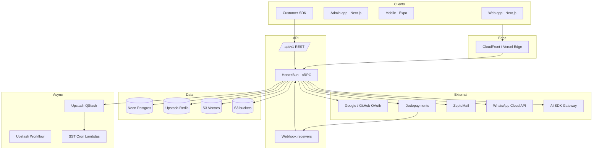
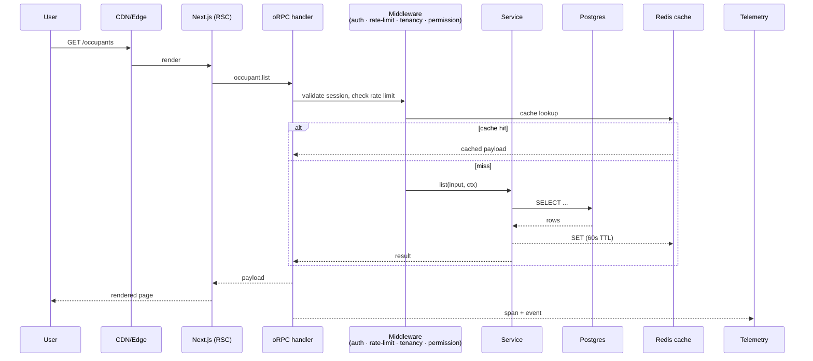
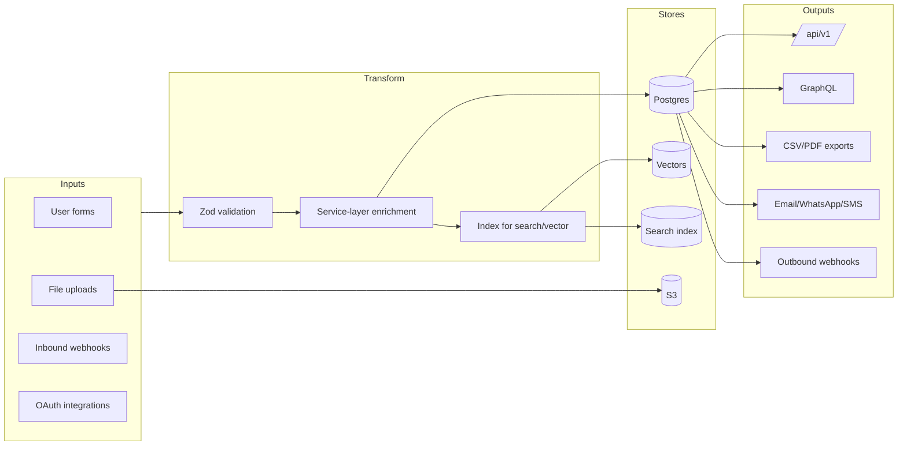
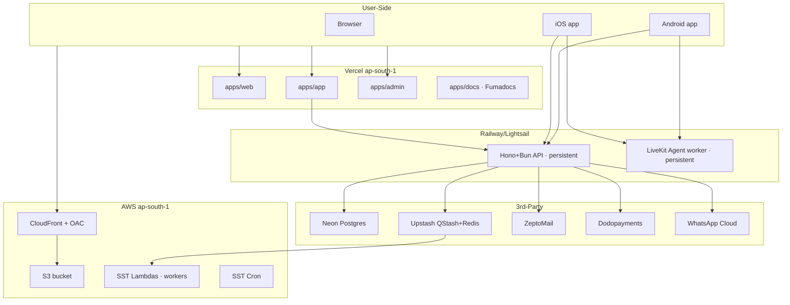
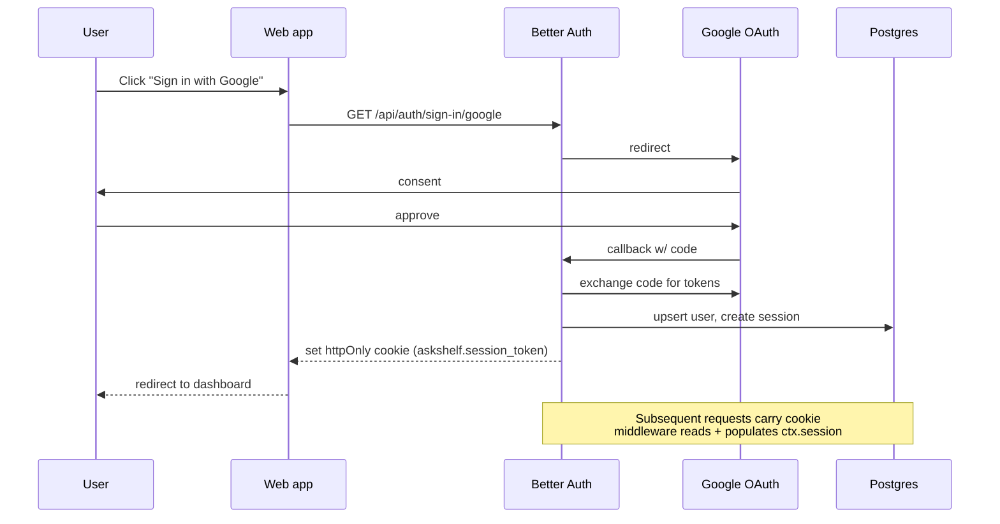
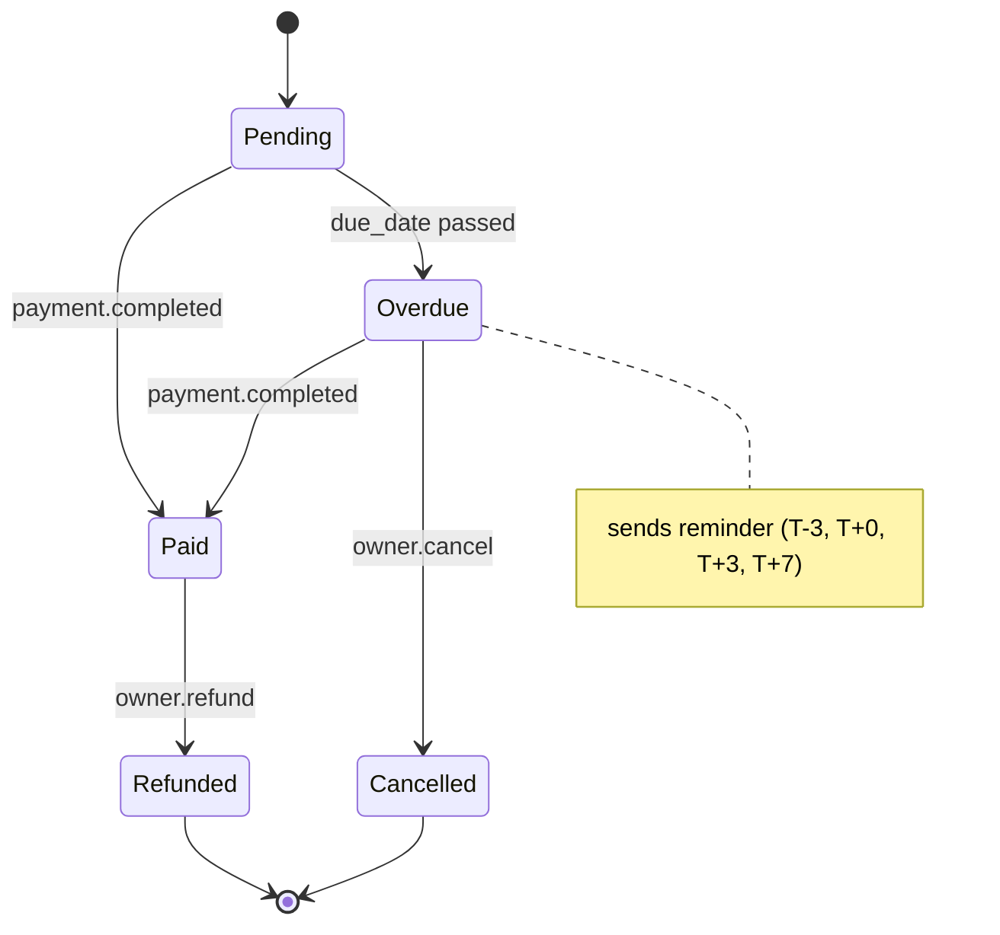
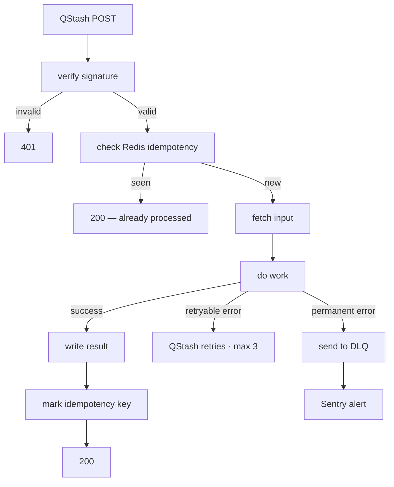
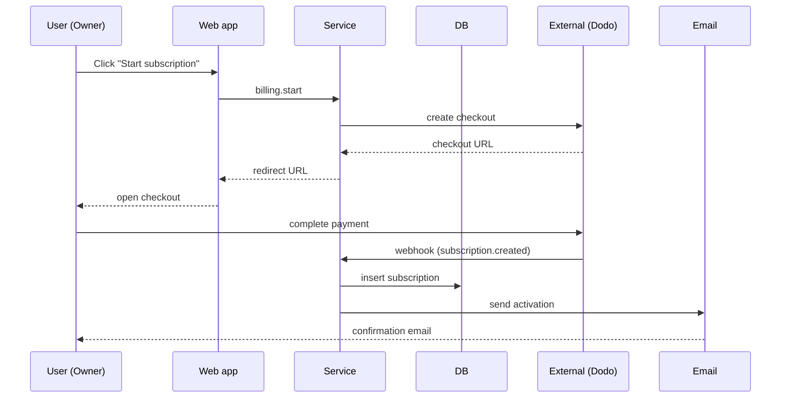

# 15 — Diagram Catalog

Every project produced by this skill ships with a layered set of Mermaid
diagrams: high-level architecture overview, per-module flows, and per-feature
sequence diagrams. The skill must generate ALL applicable diagrams below —
never skip "for brevity".

## Diagram inventory

### Project-wide (generated into `docs/project/architecture-overview.md`)

1. **System architecture** (component diagram) — every app, every service,
   every external integration, every datastore, every queue/scheduler. Shows
   how the whole thing fits together at a glance.
2. **Request lifecycle** (sequence) — a representative user request from
   client → CDN → frontend → API → DB → response. Highlights where caching,
   auth, rate limiting, telemetry hook in.
3. **Data flow** (flowchart) — where data enters (forms, webhooks, integrations,
   uploads), how it transforms (validation, enrichment, indexing), where it
   lands (Postgres, S3, vector store, search index), how it leaves (REST, GraphQL,
   webhooks out, exports, notifications).
4. **Deployment topology** — what runs where (Vercel projects, SST Lambdas,
   Hasura container, LiveKit SFU, EAS-built mobile bundles), with region
   annotations.
5. **Auth flow** (sequence) — login → OAuth → session → request authentication →
   refresh → logout, including admin-impersonation if relevant.
6. **Tenancy model** (entity-relationship) — how org/team/user/workspace
   entities relate; which tables are tenant-scoped and how.
7. **Module map** (mind-map or graph) — every module, its primary entities,
   its dependencies on other modules.
8. **Async architecture** — every queue + every scheduler + every webhook
   (in/out), with consumer Lambdas mapped.
9. **Permission flow** (sequence) — a request hitting an authenticated procedure,
   going through auth middleware → tenancy check → permission check → handler.

### Per-module (generated into `docs/project/modules/<module>/module.md`)

Every module file MUST contain these:

10. **Module component diagram** — pages of this module, components inside
    each page, API procedures called, DB tables read/written, events emitted,
    external services touched.
11. **Page navigation flow** — entry points to this module, navigation
    between pages within it, deep links from other modules, breadcrumb path.
12. **Role × page visibility matrix** (table, not diagram — but counted here
    because it lives alongside diagrams).

### Per-feature (generated into `docs/project/modules/<module>/features/feature-*.md`)

13. **End-to-end sequence** — UI → handler → service → DB → side-effects.
    The non-negotiable wiring diagram. See feature template.

### Per-stateful-entity (generated into `docs/project/modules/<module>/state-machines/status-*.md`)

14. **State machine** — every state, every transition (with the action that
    triggers it), guards, side-effects per transition.

### Per-async-job (generated into `docs/project/modules/<module>/async-jobs/job-*.md`)

15. **Job execution flow** — trigger → fetch input → process → retries → DLQ
    → alerting → success path.

### Per-workflow (generated into `docs/project/modules/<module>/workflows/workflow-*.md`)

16. **Workflow swimlane** — actors (User, System, External) across lanes,
    happy path + alternative paths + failure scenarios + recovery.

## Mermaid templates

Below are skeleton templates the skill should fill in.

### Template — System architecture (component)



### Template — Request lifecycle (sequence)



### Template — Data flow (flowchart)



### Template — Deployment topology



### Template — Auth flow



### Template — Module component diagram

```mermaid
flowchart LR
  subgraph Pages
    P1[/occupants]
    P2[/occupants/:id]
    P3[/occupants/new]
  end

  subgraph Components
    Table[OccupantTable]
    Filter[FilterBar]
    Form[OccupantForm]
    Scanner[AadhaarScanner]
    Tabs[Detail tabs · Rent/KYC/History]
  end

  subgraph API
    List[occupant.list]
    Get[occupant.get]
    Create[occupant.create]
    Update[occupant.update]
    Vacate[occupant.vacate]
  end

  subgraph DB
    T1[(occupant)]
    T2[(occupant_history)]
    T3[(kyc_doc)]
  end

  subgraph Events
    E1>occupant.created]
    E2>occupant.vacated]
  end

  P1 --> Table & Filter --> List --> T1
  P2 --> Tabs --> Get --> T1 & T2 & T3
  P3 --> Form --> Scanner
  P3 --> Create --> T1 & T2
  Create --> E1
  P2 --> Vacate --> T1 & T2
  Vacate --> E2
```

### Template — Page navigation

```mermaid
flowchart LR
  Sidebar[Sidebar · Occupants link] --> List[/occupants]
  Dashboard[Dashboard · recent activity] --> Detail[/occupants/:id]
  List --> Detail
  List --> Create[/occupants/new]
  Detail --> History[/occupants/:id/history]
  Detail --> AllocateRoom[/rooms?occupantId=:id]
  Create --> Detail
```

### Template — State machine



### Template — Job execution



### Template — Workflow swimlane



## Authoring rules

- Every diagram has a one-line caption above it explaining what it shows.
- Every node name is consistent across diagrams (don't call it "Hono server"
  in one and "API" in another).
- Use Mermaid blocks, not Graphviz / PlantUML / image embeds — Mermaid renders
  in GitHub, VS Code, most docs portals.
- If a diagram exceeds ~30 nodes, split it.
- If a project has only one module, still produce the project-wide diagrams —
  they're the entry point for Claude Code and human reviewers.
- **Diagrams are part of the change-tracking sidecar.** Any change that
  affects a diagram (new module, new external integration, removed table,
  new event) must regenerate the diagram AND bump its version.
