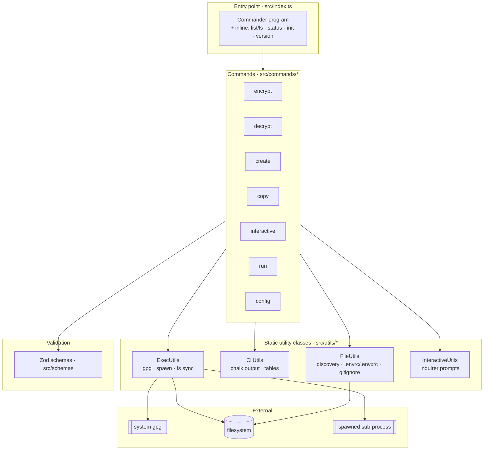
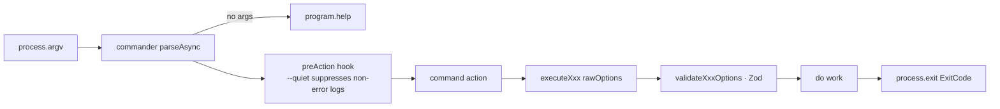
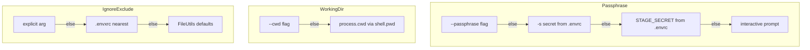
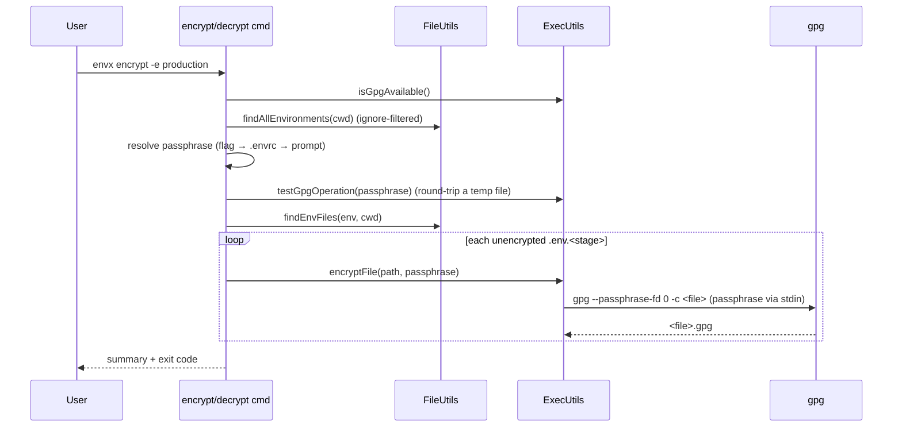
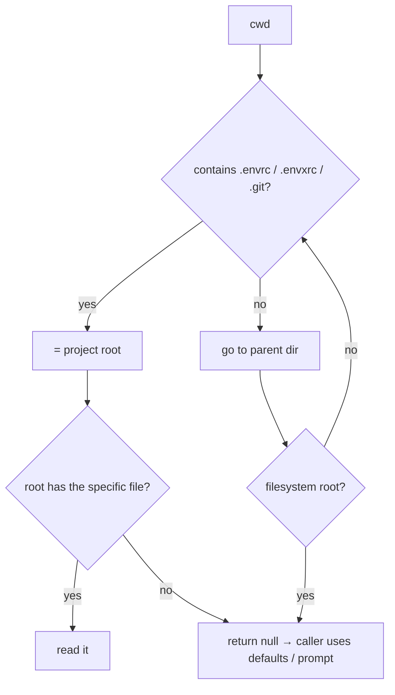
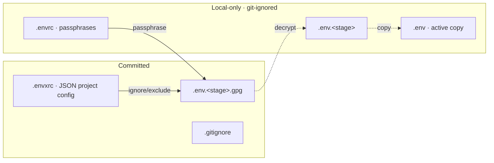

# Architecture Overview

EnvX is a thin CLI: `commander` parses argv and dispatches to a command's
`executeXxx()`, which composes four static utility classes. There is no server,
no persistent process, no network I/O — the only external process is `gpg`.

## 1. Component layers



## 2. Command dispatch



## 3. Configuration resolution

Three independent resolution chains. Each command reads what it needs.



`.envrc` (passphrases) is read via `readEnvrcNearest` and `.envxrc` (ignore /
excludeDirs / environments) via `findEnvxrcUpward` — both walk upward from `cwd`
(see diagram 6).

## 4. Encrypt / decrypt sequence



Decrypt is the mirror: it filters to `.gpg` files, backs up any existing
plaintext before writing, and restores the backup if `gpg` fails.

## 5. `envx run` — in-memory decrypt & spawn

`run` is the one command that decrypts **without touching disk**.

```mermaid
sequenceDiagram
  participant U as User
  participant R as run cmd
  participant F as FileUtils
  participant E as ExecUtils
  participant Sub as sub-process

  U->>R: envx run -e prod -- node server.js
  R->>R: collectRawSources (stage → files → inline)
  R->>F: resolveStageFile / fileExists
  R->>R: resolve passphrase only if a source is encrypted
  R->>F: loadEnvSource(...)  (decryptFileToString → parseEnvContent)
  Note over F: plaintext lives only in memory
  R->>R: mergeEnv (process.env wins unless --overload)
  alt --dry-run
    R-->>U: print sources + key names (never values)
  else
    R->>E: spawnChildWithEnv(argv, finalEnv, cwd)  (shell:false)
    E->>Sub: spawn with injected env; forward SIGINT/TERM/HUP
    Sub-->>R: exit code
    R-->>U: propagate exit code
  end
```

See [commands/features/feature-run.md](./commands/features/feature-run.md) and
[adr/0004-run-in-memory-decrypt.md](./adr/0004-run-in-memory-decrypt.md).

## 6. Upward config discovery (monorepo support)

`.envrc` and `.envxrc` are found by walking upward from `cwd`. Stage files
(`.env.<stage>[.gpg]`) are **not** — they resolve from `cwd` only.



`findProjectRoot` stops at the first ancestor holding any marker; `findEnvrcUpward`
/ `findEnvxrcUpward` then confirm the specific file exists there. Writes via
`mergeEnvxrc` target that nearest existing `.envxrc`, so `envx config …` from a
subdirectory edits the root config.

## 7. On-disk artifacts



## Related

- [tech-stack.md](./tech-stack.md)
- [commands/commands.md](./commands/commands.md)
- [decisions.md](./decisions.md)

## Changelog

| Version | Date       | Changes                          |
| ------- | ---------- | -------------------------------- |
| 1.0     | 2026-07-12 | Initial reverse-engineered draft |
