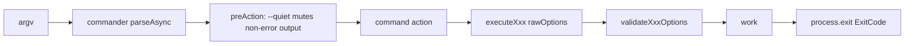

# Module: Commands

## Purpose

EnvX is a single CLI surface. This "module" is the whole tool: the command
inventory, the behavior every command shares (cwd resolution, discovery,
passphrase resolution, output), and the two different meanings of `--all`.

Each command lives in `src/commands/<name>.ts` (except the inline ones, which live
in `src/index.ts`) and exports `createXxxCommand()` + `executeXxx()`.

## Command inventory

| Command                               | File                      | One-liner                                                  | Feature spec                                                       |
| ------------------------------------- | ------------------------- | ---------------------------------------------------------- | ------------------------------------------------------------------ |
| `encrypt`                             | `commands/encrypt.ts`     | GPG-encrypt `.env.<stage>` → `.gpg`                        | [feature-encrypt](./features/feature-encrypt.md)                   |
| `decrypt`                             | `commands/decrypt.ts`     | GPG-decrypt `.gpg` → `.env.<stage>`                        | [feature-decrypt](./features/feature-decrypt.md)                   |
| `create`                              | `commands/create.ts`      | Create new `.env.<stage>` files (optionally from template) | [feature-create](./features/feature-create.md)                     |
| `copy`                                | `commands/copy.ts`        | Copy a stage file to plain `.env` (auto-decrypts)          | [feature-copy](./features/feature-copy.md)                         |
| `interactive`                         | `commands/interactive.ts` | Set up `.envrc` secrets via prompts                        | [feature-interactive](./features/feature-interactive.md)           |
| `run`                                 | `commands/run.ts`         | Decrypt in memory, run a sub-process with vars injected    | [feature-run](./features/feature-run.md)                           |
| `config`                              | `commands/config.ts`      | Manage `.envxrc` (show / ignore / exclude / reset)         | [feature-config](./features/feature-config.md)                     |
| `files`                               | `commands/files.ts`       | Register + GPG-encrypt/decrypt arbitrary secret files      | [feature-files](./features/feature-files.md)                       |
| `init` `list`/`ls` `status` `version` | `index.ts` (inline)       | First-run setup, listing, status, version info             | [feature-project-commands](./features/feature-project-commands.md) |

## Command dispatch

## Shared behavior

- **Global flags:** `-v, --verbose`, `-q, --quiet` (registered on the program).
  `--quiet` overrides `console.log` to drop everything except messages containing
  `✗`.
- **Working directory:** `--cwd <path>` else `ExecUtils.getCurrentDir()`
  (`shell.pwd()`). Every command accepts `-c, --cwd`.
- **Discovery:** `FileUtils.findAllEnvironments(cwd)` globs `**/.env.*`, skips
  `excludeDirs`, filters `ignore` names. `findEnvFiles(stage, cwd)` returns plain +
  `.gpg` variants, each flagged `encrypted`.
- **Passphrase resolution** (encrypt/decrypt/copy/run): `--passphrase` → `-s
<secret>` from `.envrc` → `<STAGE>_SECRET` from `.envrc` → interactive prompt.
  `.envrc` is read via `readEnvrcNearest` (upward walk).
- **GPG guard:** commands that touch crypto check `isGpgAvailable()` and, for
  encrypt/decrypt, run `testGpgOperation` (a temp-file round-trip) before real work.
- **Output:** all through `CliUtils` (chalk) — `success ✓`, `error ✗`, `warning ⚠`,
  `info ℹ`, headers, tables.
- **Exit codes:** `ExitCode` enum — `SUCCESS 0`, `GENERAL_ERROR 1`,
  `INVALID_ARGS 2`, `FILE_ERROR 3`, `GPG_ERROR 4`, `USER_CANCELLED 5`.

## The `--all` matrix (important)

`--all` means different things per command, and Zod validation enforces it:

| Command               | `--all` means                             | `-e/--environment` with `--all`    |
| --------------------- | ----------------------------------------- | ---------------------------------- |
| `encrypt` / `decrypt` | all discovered **environments**           | **forbidden** (mutually exclusive) |
| `copy`                | all **directories** containing that stage | **required**                       |
| `run`                 | (no `--all`)                              | —                                  |

`validateEncryptOptions` / `validateDecryptOptions` swap to a permissive schema
when `--all` is set; `validateCopyOptions` throws if `--all` is set without `-e`.

**Registered files ride along `encrypt`/`decrypt`:** `-e <stage>` also processes any
`files` registry entries bound to that stage (reusing the resolved passphrase);
`--all` also processes **every** registered entry, stage-bound and global alike
(global entries resolve against `FILES_SECRET`). See
[feature-files](./features/feature-files.md).

## Cross-cutting

- **Config resolution order:** passphrase → flag > `.envrc` > prompt; cwd → flag >
  `process.cwd()`; ignore/exclude → explicit arg > `.envxrc` > `FileUtils` defaults.
- **Monorepo:** `.envrc`/`.envxrc` resolved by upward walk; stage files are
  cwd-local. See [architecture-overview.md](../architecture-overview.md) §6.

## Test plan summary

See [test-plan.md](../test-plan.md).

## Open questions

- [ ] None outstanding at reverse-engineering time.

## Changelog

| Version | Date       | Changes                                                            |
| ------- | ---------- | ------------------------------------------------------------------ |
| 1.0     | 2026-07-12 | Initial reverse-engineered draft                                   |
| 1.1     | 2026-07-12 | Add `files` command row + `--all` ride-along note for `envx files` |
